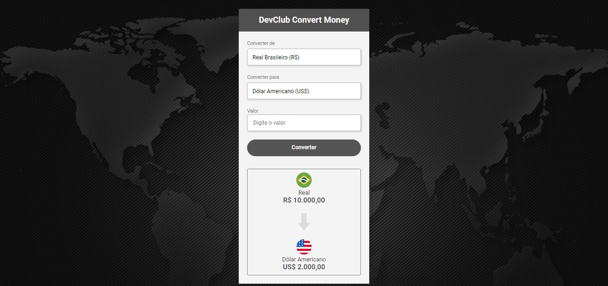

<h1>Olá, tudo bem? 👋</h1>

Através das aulas de JavaScript pelo <strong><a href="https://rodolfomori.com.br/devclub-privado/" target="_blank">DevClub</a></strong> com o <a href="https://github.com/rodolfomori" target="_blank">Rodolfo Mori</a>, desenvolvi uma aplicação de conversão de moedas, podendo converter da moeda real para euro, dólar americano e bitcoin.

<h2>As ferramentas utilizadas foram: ✔</h2>

<a target="_blank" href="https://www.javascript.com/"/> 

<h2>Para acessar o conversor basta acessar o link abaixo:</h2>
<h3><a href="https://erikvasconcelos.github.io/coin-converter/" target="_blank">💲 Coin Converter</a></h3>
<h2></h2>
<h2>Preview do conversor ✨</h2>

<h3>Muito obrigado pela visita e volte sempre 📌</h3>

Estarei aqui para ajudar 👨‍💻

